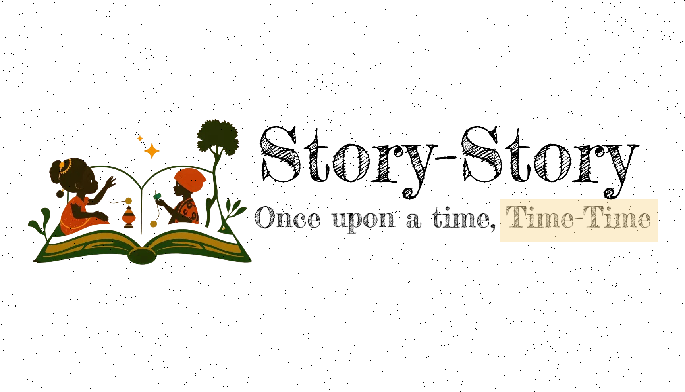

# Story-Story



**Story-Story** is an engaging storytelling app designed for children. It takes the rich histories of Nigerian and African figures and turns them into child-friendly, factual stories. With vibrant illustrations and captivating narratives, Story-Story aims to make history come alive for young minds. Stories are generated using an LLM agentic workflow, see code [here](https://github.com/Daheer/story-story-ai).

---

## 🌟 Features

- **Rich Content**: Authentic stories about African historical figures tailored for children.
- **Interactive Experience**: Vibrant illustrations for every chapter of the story.
- **Easy Navigation**: A seamless and child-friendly interface.
- **Educational Value**: Stories that inspire, educate, and connect children to their roots.

---

## 🚀 Getting Started

### Prerequisites
- **Node.js** (>= 16.x)
- **NPM** or **Yarn**
- A Supabase project for managing story data and illustrations.

### Installation

1. Clone the repository:
```bash
git clone https://github.com/Daheer/story-story.git
cd story-story
```
2. Install dependencies:

```bash
pnpm install --legacy-peer-deps
```
3. Set up environment variables in a .env.local file:
```
NEXT_PUBLIC_SUPABASE_URL=<your-supabase-url>
NEXT_PUBLIC_SUPABASE_ANON_KEY=<your-supabase-anon-key>
```
4. Start the development server:

```bash
npm run dev
```
Access the app at [http://localhost:3000](http://localhost:3000)

## 🛠️ Usage

### Writing a Story (coming to public soon)

- Simply provide the hero's name and the AI agents will handle it from there!

### Reading a Story

- Navigate through the chapters using the app's intuitive interface build with ShadcnUI.
- View beautiful illustrations that accompany each chapter.

## 📦 Database Structure

The app uses Supabase for storing story-related data. Here's a brief schema overview:

### Tables
1. Stories:

- `id`: Primary Key
- `title`: Title of the story
- `historical_figure`: Name of the figure
- `description`: Brief description
- `created_at`: Timestamp

2. StoryPages:

- `id`: Primary Key
- `story_id`: Foreign Key (References Stories)
- `page_number`: Page number in the story
- `chapter`: Chapter content
- `illustration_url`: URL for the illustration
- `prompt`: Prompt used to generate illustrations

## 🎨 Design Style

- Fonts: Uses fonts with African accents like `Fredericka the Great` from Google Fonts.
- Colors: Warm, earthy tones to reflect African culture.
- Illustrations: Child-friendly, vibrant, and culturally relevant.

## 🤝🏾 Contributing
Contributions are highly welcome! 

Here are ideas I am currently working on
- [x] Illustrations
- [ ] Narrator

Follow these steps:

1. Fork the repository.
2. Create a new branch:
```bash
git checkout -b feature/your-feature-name
```
3. Commit your changes:
```bash
git commit -m "Add your message here"
```
4. Push to your branch:
```bash
git push origin feature/your-feature-name
```
5. Open a pull request.

Made with ♥️ for African Heroes by Deedax
